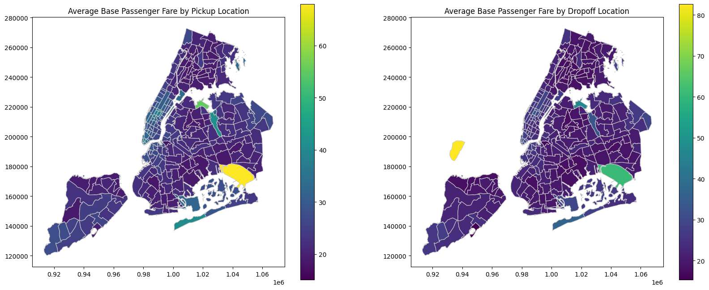

# New York Rideshare Price Prediction

## Overview

This project aims to predict rideshare fares in New York City using historical trip data from the TLC (Taxi and Limousine Commission). The analysis explores the key factors influencing fare prices and provides insights for rideshare companies to optimize their pricing strategies.

## Dataset

The dataset used in this analysis consists of monthly High Volume For-Hire Vehicle (HVFHV) trip records from January 2024 to December 2024, obtained from the [TLC Trip Record Data](https://www.nyc.gov/site/tlc/about/tlc-trip-record-data.page).

## Key Findings

-   **Trip Distance and Time:** These are the most significant drivers of fare prices. Longer trips and longer durations result in higher fares.
-   **Location:** Pickups and dropoffs at airports (e.g., EWR) are significantly more expensive. Pickups in Manhattan tend to be pricier, while dropoffs outside of NYC also increase the fare.
-   **Limited Impact of Other Factors:** Surprisingly, weather, holidays, weekends, time of day, and accessibility requests (wheelchair accessible vehicles) have a minimal direct impact on the base fare. The model suggests that increased trip time due to traffic (potentially caused by weather) might be a more significant factor.

## New York Average Base Fare Map

## Technical Details

-   **Programming Language:** Python
-   **Libraries:**
    -   pandas
    -   numpy
    -   scikit-learn
    -   xgboost
    -   geopandas
    -   matplotlib
    -   seaborn

## Data Preparation

1.  **Missing Data Handling:**
    -   Missing `originating_base_num` values (Lyft) were filled with "Missing".
    -   Missing `on_scene_datetime` values (Lyft) were imputed with a placeholder date and a binary indicator column was created.
    -   Rows with missing `originating_base_num` for Uber were removed.
2.  **Feature Engineering:**
    -   Log transformations were applied to skewed features (`trip_miles`, `trip_time`, `base_passenger_fare`, `bcf`, `tolls`).
    -   Distance between pickup and dropoff locations was calculated using `geopandas` and taxi zone shapefiles.
    -   Time-based features were extracted from `pickup_datetime` (month, day, weekday, hour, minute) and cyclic features were created using sine and cosine transformations.
    -   Weather data was obtained using the `openmeteo_requests` library and merged with the trip data.
    -   A binary feature (`is_holiday`) was created based on a list of holidays in 2024.
3.  **Encoding:**
    -   Binary features were encoded as 0 and 1.
    -   `weather_code` was ordinal encoded.
4.  **Outlier Removal:**
    -   Outliers in `base_passenger_fare` were removed based on percentiles (0.04% and 99.96%).

## Model Development

-   **Model:** XGBoost Regressor
-   **Features:**
    -   Categorical: `DOLocationID`, `PULocationID`, `originating_base_num` (one-hot encoded)
    -   Binary: `access_a_ride_flag`, `shared_request_flag`, `wav_match_flag`, `on_scene_datetime_missing`, `distance_outofNYC`
    -   Numerical: `trip_miles_log`, `trip_time_log`, `distance`, `request_to_pickup`, `request_to_on_scene`
-   **Target Variable:** `base_passenger_fare_log`
-   **Preprocessing:**
    -   Numerical features were scaled using `StandardScaler`.
    -   Categorical features were one-hot encoded using `OneHotEncoder`.
-   **Hyperparameter Tuning:**
    -   `GridSearchCV` was used to tune hyperparameters (`n_estimators`, `max_depth`, `learning_rate`).
-   **Evaluation Metrics:**
    -   Mean Absolute Error (MAE)
    -   Root Mean Squared Error (RMSE)
    -   R-squared

## Results

The final XGBoost model achieved the following performance on the test set:

-   MAE: $4.42
-   R-squared: 0.8527

## Business Insights

-   **Distance and Time Dominate:** Rideshare pricing is heavily influenced by trip distance and time.
-   **Location-Based Pricing:** Trips to and from airports and drop-offs outside of NYC command higher fares. Manhattan pickups are also more expensive.
-   **Limited Impact of External Factors:** Weather, holidays, and time of day have a surprisingly small direct impact on the base fare.
-   **Potential Pricing Strategies:**
    -   Consider increasing prices for trips to/from airports and drop-offs outside of NYC, as customers appear less price-sensitive for these trips.

